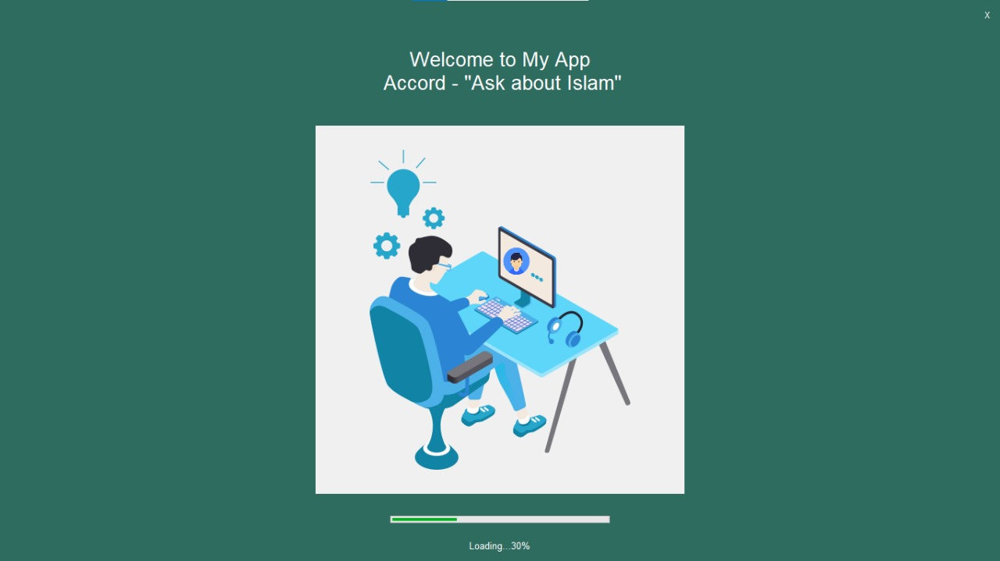
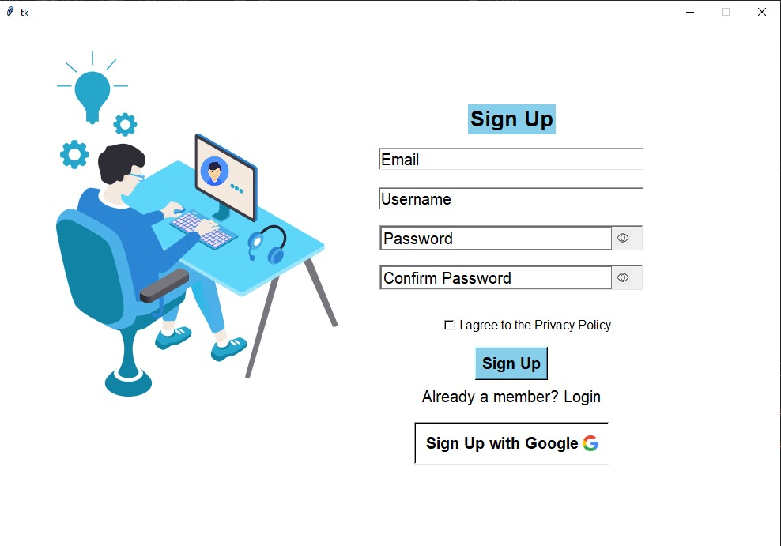
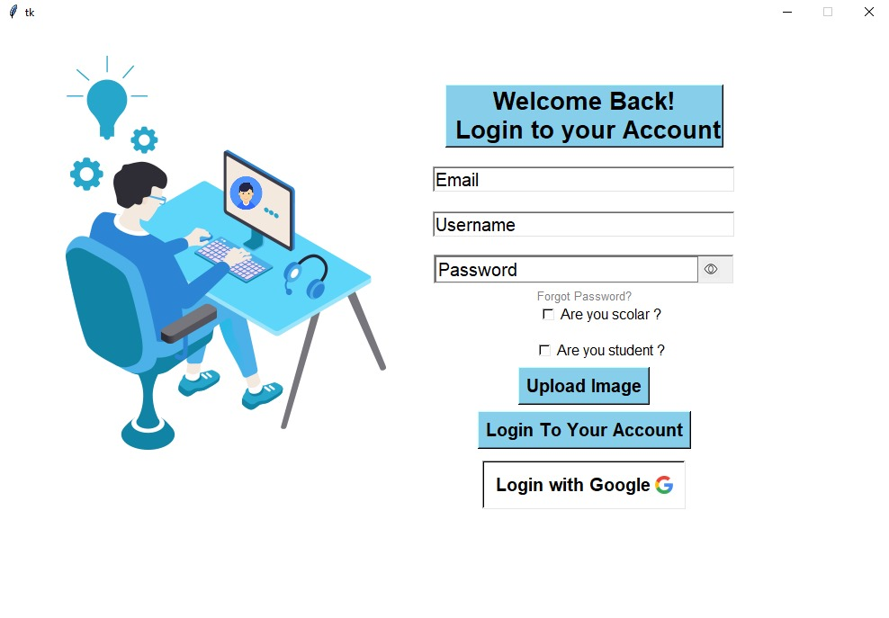
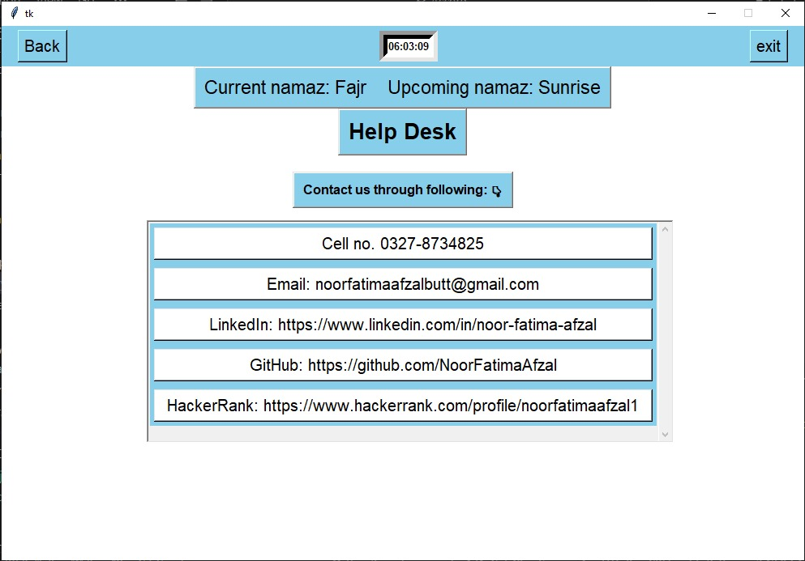
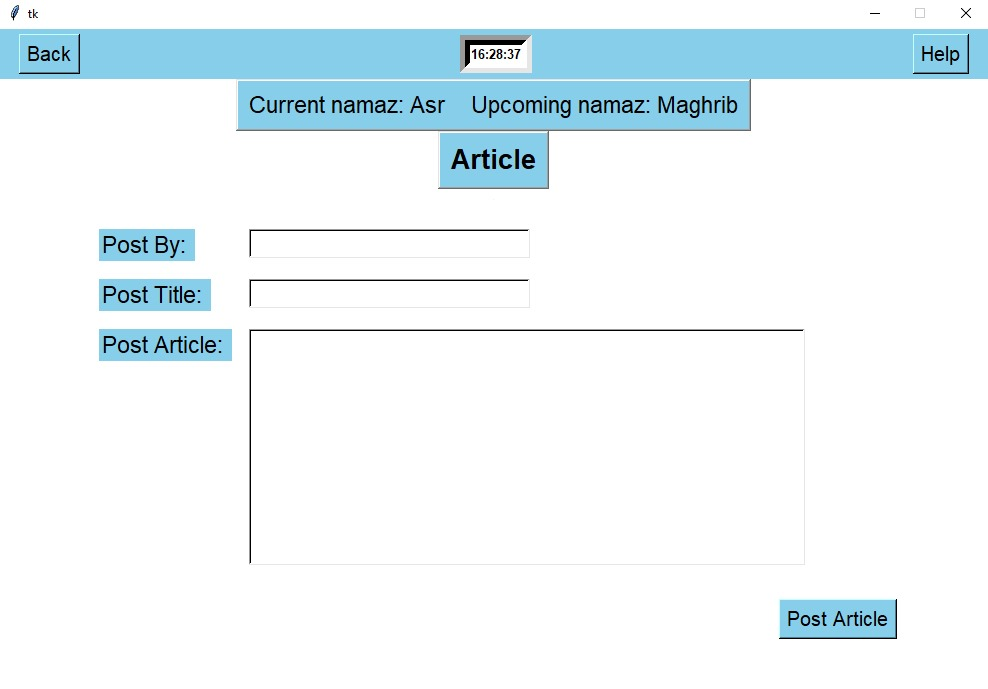
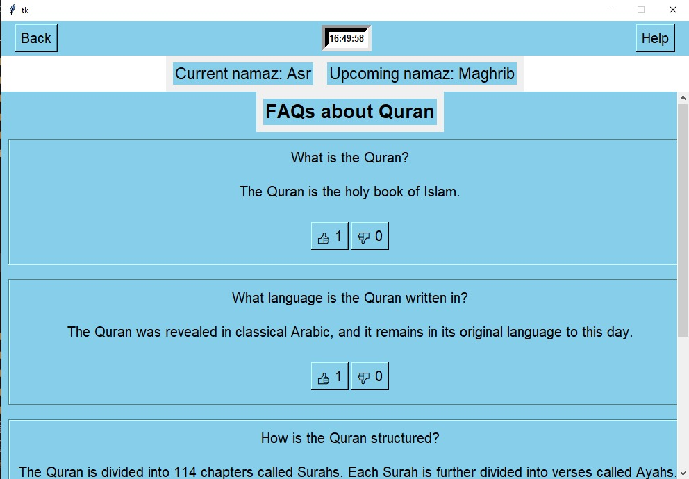
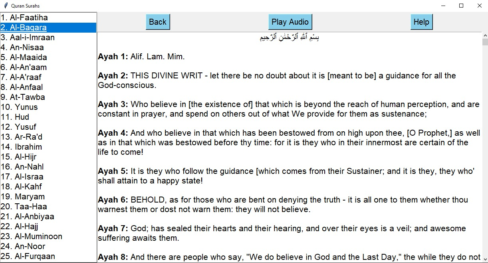
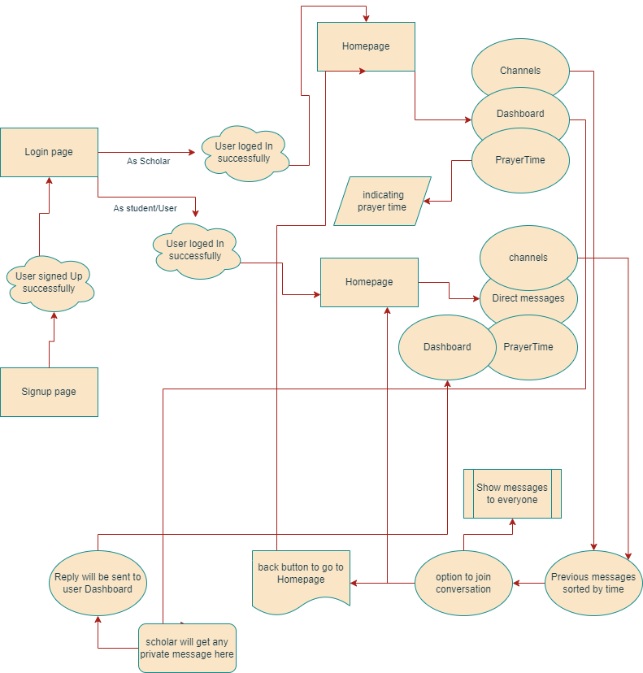
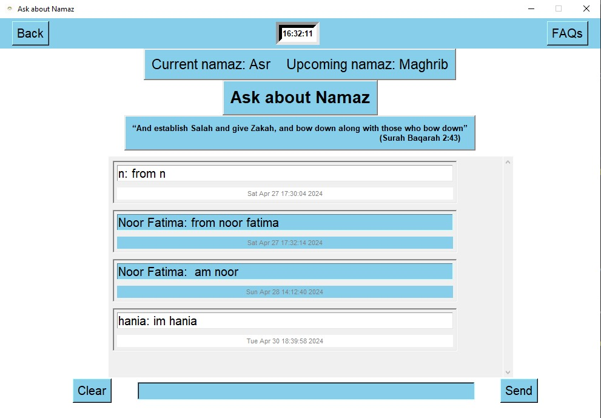

# Accord - Ask about Islam

<!-- <br> -->

<hr>

## Table of contents

- [Accord - Ask about Islam](#code-innovate-chat-hub---group-chat-app)
  - [Table of contents](#table-of-contents)
  - [Overview](#overview)
  - [Requiremnts](#requiremnts)
  - [UX](#ux)
    - [Strategy](#strategy)
    - [Scope](#scope)
    - [Structure](#structure)
    - [Skeleton](#skeleton)
    - [Surface](#surface)
      - [Colour Scheme](#colour-scheme)
      - [Fonts](#fonts)
      - [Visual Effects](#visual-effects)
  - [Features](#features)
    - [Existing Features](#existing-features)
      - [Account pages](#account-pages)
      - [Group chat/Homepage](#group-chathomepage)
      - [Messaging](#messaging)
      - [Header Navigation section](#header-navigation-section)
    - [Future Feature Considerations](#future-feature-considerations)
  - [Tools Used](#tools-used)
  - [Testing](#testing)
  - [Acknowledgements](#acknowledgements)

## Overview

"Accord" is a Python-based GUI project designed to facilitate scholarly discussions and knowledge sharing on religious topics. It features user signup and signin modules, channels for different religious topics, private messaging with scholars, Namaz reminders, and prayer timing displays. Additionally, it includes a calendar to track important dates and events, as well as the option to listen to the entire Quran and read its translation. "Accord" aims to create a user-friendly environment for seekers of knowledge and scholars to engage in meaningful discussions and receive guidance. With its intuitive navigation and engaging interface, "Accord" provides a seamless platform for individuals to deepen their understanding of religion and connect with experts in their field. Through personalized interactions and practical tools, it empowers users to navigate their spiritual journeys effectively while fostering a vibrant community of learning and exchange.
<br><br>
The full project can be accessed here [Accord](https://github.com/NoorFatimaAfzal/Accord/tree/main).
<br><br>

## Requiremnts

Requiremts.txt file contains all the dependencies required for the project to run. To install the dependencies, run the following command in the terminal:<br>
```bash
pip install -r requirements.txt
```
<br>

## UX

This App is created respecting the Five Plans Of Website Design:<br>

### Strategy<hr>

**Project Goal:**
<br>
Create a website similar to Discord but specifically tailored for Religious puroposes.

**Project Objectives:**<br>

- Develop a real-time messaging platform to facilitate seamless religious communication among "Accord" community members.
- Implement a user-friendly interface with religious channels dedicated to various Religious topics, fostering organized discussions.
- Enhance user engagement in direct messages and group chat for interactive conversations.
- Establish secure user authentication, authorization, and profile management features to ensure a personalized and protected user experience.
  <br><br>

### Scope<hr>

**User Management**

- User registration and authentication with google.
- User roles and permissions for various levels of access.
- Profile creation and management.

**Communication Features**

- Real-time messaging functionality for group discussions in channels.
- Direct messaging for private one-on-one conversations.
- Notifications for Queries will be sent to scholar.
- Notification for Queries' answers will be sent to student.

**Channel Management**

- Creation of Channels on different topics.
- Categorization of channels based on Religious topics or modules.
- Ability to search relevant channels.

**User Interface and Experience**

- Intuitive and user-friendly interface for seamless navigation.
- Responsive design.
- Personalization options for user profiles.<br><br>

**Read and Listen Quran**

- Read the Quran with translation.
- Listen to the Quran with translation.

**Prayer Timings**

- Display prayer timings.
- Send Namaz reminders through Email.

**Calendar**

- Display current date.

### Structure<hr>

The structure of the app is divided into different pages but with content depending on authentication and scholar/student status <br>

- **Register/Login/** for this the File handling was used, the pages give the user the possibility to create an account, login or log out.<br>

- The **Home** page consists of 2 sections <br> 1.channels <br> 2.Direct messages list.They will be loaded using File Handling depending on the user clicks<br>

- The **header** is visible on all pages it consists of a time label, back button and help button. <br>

- The **Header Search bar** is used to find another user.<br>

- **Messages** contains an inbox to do the direct private messages to scholars and Students. <br>

- **FAQs** contains the frequently asked questions and their answers.<br>

- **Help** contains the help page for the user.<br>

- **Post Articles** contains the page where the user can post articles.<br>

- **Read Articles** contains the page where the user can read articles.<br>

- **Quran** contains the page where the user can read and listen to the Quran.<br>

### Skeleton<hr>

**Structures**<br>
The structures for desktop can be viewed here<br>

<details>
  <h4>Loading page</h4>
  <br>
  <h4>Sign up page</h4>
  <br>
  <h4>Login page</h4>
  <br>
  <h4>Channels list</h4>
  <br>
  <h4>Help Page</h4>
  <br>
  <h4>Post Articles</h4>
  <br>
  <h4>Read Articles</h4>
  <br>
  <h4>FAQs</h4>
  <br>
  <h4>Quran</h4>
  <br>
</details><br>

**FLOWCHARTS**<br>
The Flowchart for my program was created using <b>[draw.io](https://app.diagrams.net/)</b> and it visually represents how the system works.<br>
<br>
<br><br>

### Surface<hr>

#### Colour Scheme

- The primary colour scheme was used for body, headers and nav elements<br>
  
  
  
  
  
  <br>

- The secondary colour scheme was used for buttons, warnings, errors or for highlighting important information.<br>
  
  
  
  

#### Fonts

- The fonts I used for this site were imported from [Google Fonts](https://fonts.google.com/):<br>
  - **Roboto** - for the body text<br>
  - **Lato** - for the headings<br>
  - **Open Sans** - for the buttons<br>

#### Visual Effects

- **Box shadows** <br>
  Multiple box shadows were used for the cover, buttons and images. <br>

## Features

### Existing Features<hr>

#### Account pages

   - Implement secure user signup and signin modules.
   - Allow users to create and manage their profiles.
   - Differentiate between regular users and scholars/experts.
   - Provide user authentication and authorization features.
- Sign up page<br><br>
  <br><br>
- Sign in page<br><br>
  <br><br>

#### Group chat/Homepage

- On the group chat homepage the page will have interface like this.

  1. The channels list <br><br>
     - The channels will be of different religious topics.
     - The scholars and users will be able to do group chat. <br><br>
       <br><br>
  2. The chat in a particular channel on which user has clicked.<br><br>
     <br><br>

#### Messaging

- On the _Messages_ page, users can do private message to scholars in order to get their queries answered.
  <br><br>
  <br><br>

#### Header Navigation section

The Header section contains the back button, help button and current time.<br>
<br>
<br><br>
<br>

### Future Feature Considerations<hr>

- Another feature would be voice and video calls

## Tools Used

[GitHub](https://github.com/) - used for hosting the source code of the program<br>
[Visual Studio](https://code.visualstudio.com/) - for writing and testing the code<br>
[Balsamiq](https://balsamiq.com/wireframes/) - for creating the wireframes<br>
[Draw.io](http://draw.io/) - used for creating the Flowchart and Database relational schema<br>
[Favicon.io](https://favicon.io/) - used for generating the website favicon<br>
[Font Awesome](https://fontawesome.com/) - for creating atractive UX with icons<br>
[Google Fonts](https://fonts.google.com/) - for typography<br>
[PEP8 Validator](http://pep8online.com/) - used for validating the python code<br>